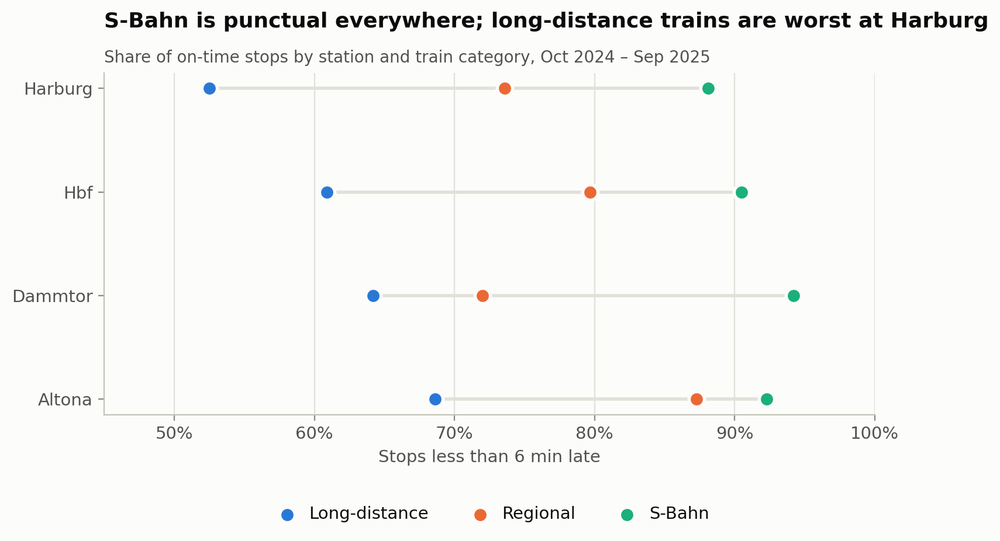
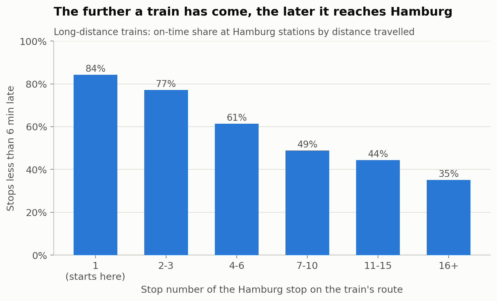
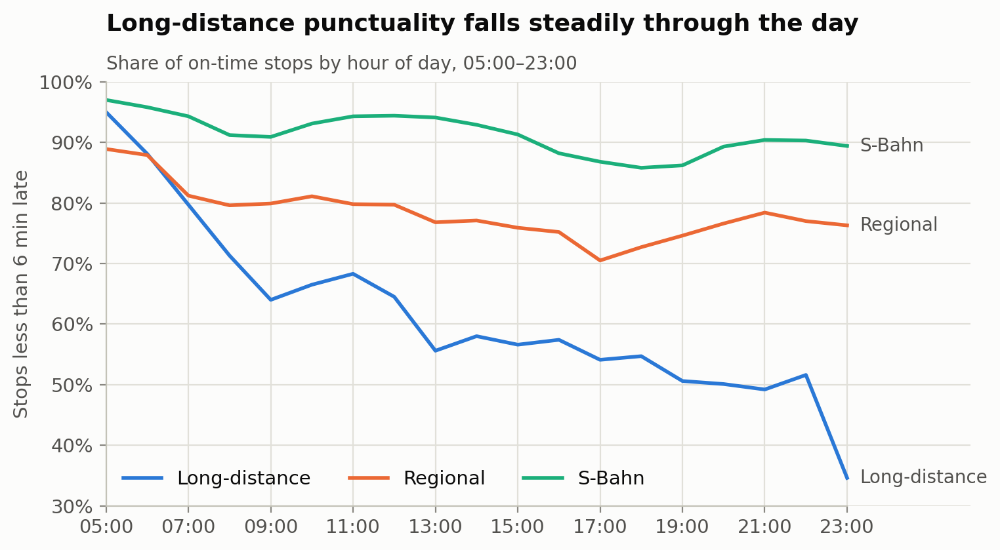
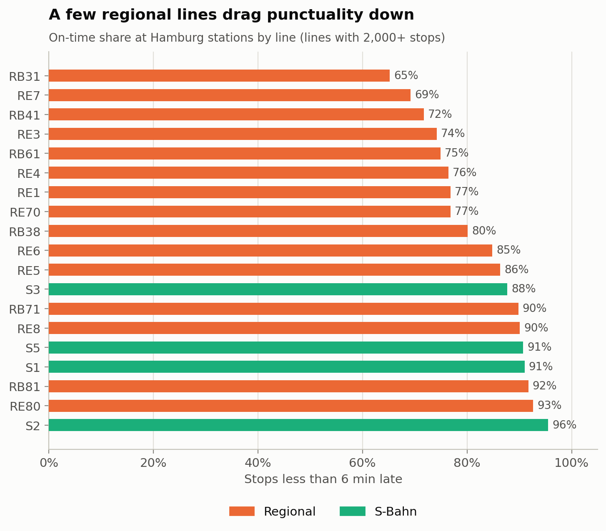

# Where do Hamburg's train delays come from?

An analysis of **1.5 million train stops** at Hamburg's four main stations (Hbf, Dammtor, Altona, Harburg) from October 2024 to September 2025, using **SQL (SQLite)** and **Python (pandas)**.

Every question is answered twice, once in SQL and once in pandas, and the notebook checks that both give the same result.

➡️ **[Open the notebook](notebooks/hamburg_train_delays.ipynb)** · SQL queries in [`sql/`](sql/)

---

## Key findings

**1. Train type matters far more than station.**
S-Bahn stops are on time 91% of the time, regional stops 78%, long-distance stops only 61%. Long-distance trains are also canceled most often (8.5% of stops vs 2.4% for the S-Bahn).



**2. Long-distance delay is mostly imported, not created in Hamburg.**
Long-distance trains that start in Hamburg are on time 84% of the time. Trains that have already made 16 or more stops before reaching Hamburg are on time only 35% of the time. Following the same train from one Hamburg station to the next (SQL `LAG()` window function) confirms this: trains coming in via Harburg arrive about 18 minutes late on average, but add less than 1 minute on the way to the Hbf.



**3. Delay builds up over the day.**
Long-distance punctuality falls from 95% at 05:00 to around 50% in the evening. S-Bahn and regional trains dip during the evening rush hour and then recover.



**4. Reliability is line-specific.**
RB31, RE7 and RB41 are late on 28–35% of their stops. Other regional lines (RE80, RB81, RE8) are on time more than 90% of the time, as often as the S-Bahn.



---

## How the data was cleaned

Real-world data needed decisions before any average could be trusted. The checks are in [`sql/01`–`03`](sql/), and the cleaning is in section 3 of the notebook.

| Issue found | Decision |
|---|---|
| **March 2025 missing** in the source (3 rows for the whole month) | Excluded; results cover 11 complete months |
| 4,580 replacement **buses** | Removed; they are not trains |
| 58,183 **canceled** stops still carry a delay value | Delay set to missing; counted in the cancellation rate instead |
| 375 stops "early" by more than 30 minutes (up to −1,432 min) | Removed; the changed timestamp is on the wrong day, a date error in the feed |
| Small early arrivals (−1 to −30 min) | Counted as 0 minutes late |
| Same line under different labels (`ME RE3`, `RE 7`, `NBE RB61`) | Normalised to one format (`RE3`, `RE7`, `RB61`) |
| Undocumented meaning of `delay_in_min` | Recomputed from timestamps: it matches departure delay (arrival delay at a train's last stop) for 100% of rows |

**On time** = less than 6 minutes late, following Deutsche Bahn's official punctuality threshold.

## SQL techniques used

| File | What it answers | Techniques |
|---|---|---|
| `01_rows_per_month.sql` | Is every month complete? | `GROUP BY`, conditional `SUM`, date functions |
| `02_quality_flags.sql` | Which rows can't be trusted? | Conditional aggregation |
| `03_line_name_variants.sql` | Are labels consistent? | `GROUP BY`, `ORDER BY`, `LIMIT` |
| `04_punctuality_by_station.sql` | Q1: punctuality by station and train type | `AVG` over flags, `NULL` handling |
| `05_punctuality_by_hour.sql` | Q2: punctuality by hour | `strftime`, `CAST` |
| `06_delay_by_stops_travelled.sql` | Q3: is delay imported? | `CASE WHEN` bucketing |
| `07_delay_change_between_stations.sql` | Q3: delay added between stations | CTE, `LAG()` window function, `HAVING` |
| `08_line_ranking.sql` | Q4: least reliable lines | CTE, `RANK() OVER (PARTITION BY …)` |

## Limitations

- Punctuality is measured **per stop, not per passenger**: a full ICE and an empty late-night train count the same.
- The delay is **departure delay** at Hamburg, not the delay a passenger experiences at the end of their journey.
- March 2025 is missing from the source data.

## Run it yourself

```bash
pip install -r requirements.txt
python scripts/fetch_data.py                            # downloads 12 monthly files, keeps the four Hamburg stations
jupyter notebook notebooks/hamburg_train_delays.ipynb   # builds data/hamburg.db on first run
```

The data is not stored in this repository. `scripts/fetch_data.py` downloads each monthly file from the source and writes the Hamburg subset to `data/raw/`.

The Hamburg subset of the data is included in `data/raw/`. To download it again from the source, run `python scripts/fetch_data.py`.

## Repository structure

```
├── data/raw/          Monthly Parquet files, Hamburg stations only (Oct 2024 – Sep 2025)
├── sql/               8 SQL queries: 3 data-quality checks, 5 analysis questions
├── notebooks/         Full analysis: question → SQL → pandas cross-check → chart → finding
├── images/            Charts used in this README
└── scripts/           Data download and filtering
```

## Data source

Deutsche Bahn Timetables API data, collected and published by [piebro/deutsche-bahn-data](https://github.com/piebro/deutsche-bahn-data) under **CC BY 4.0**. This project uses the monthly releases in their pre-May-2026 schema.

---

*Author: Md Abdul Hamid · [LinkedIn](https://www.linkedin.com/in/abdul--hamid) · M.Sc. Information and Communication Systems, TUHH*
